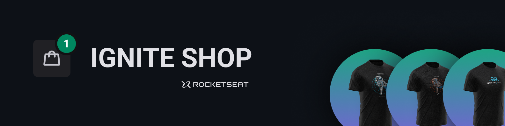
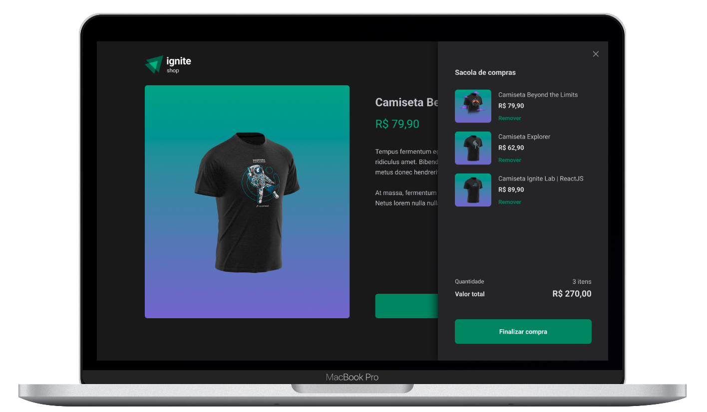

  

  
  <a aria-label="Completed" href="https://rocketseat.com.br/">
    </img>
</a>
    

## :speech_balloon: Overview

This project was built during module IV of the [Rocketseat](www.rocketseat.com.br) Ignite program and aimed to develop a virtual store using the [Next.js](https://nextjs.org) framework.  
The application allows the choice and purchase of products, and redirects the user to make payment via the [Stripe](https://stripe.com/br) platform.

## :camera: Preview

  

### :sparkles: Features

- Product visualization
- Page for viewing details and purchasing the product

The following are some of the concepts put into practice during development:

- Fundamentals of Next.js
- Single Page Applications
- Server-side rendering (SSR) application
- Creation of static pages (SSG)
- File-system based routing
- Styling with Stitches
- Integration with Stripe API to:
  - Product search
  - Making payment

## :rocket: Tools

  
  
  
  
  
 

 

  Made with :purple_heart:

